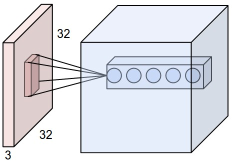
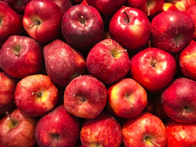
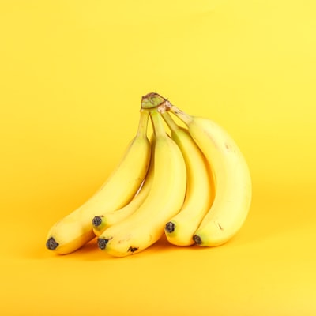
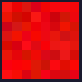
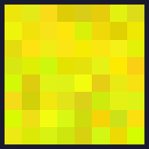
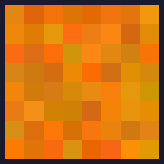
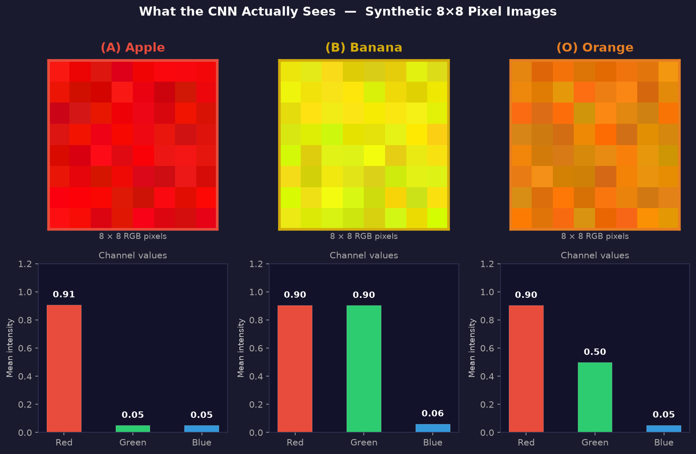

# 2. Convolutional Neural Network (CNN)

## Model Overview
CNN uses convolutional filters to extract spatial (color) features from images. Ideal for image classification.

## Architecture Diagram


*How a CNN extracts features: each filter scans the image to detect edges, colors, and patterns.*

## Fruit Classes — Real Photos vs What the Model Sees
The CNN doesn't train on real photos. It trains on tiny **8×8 synthetic pixel images** designed to have distinct color signatures:

| | 🍎 Apple | 🍌 Banana | 🍊 Orange |
|---|:---:|:---:|:---:|
| **Real Photo** |  |  |  |
| **8×8 Pixels** (model input) |  |  |  |
| **Class Label** | `0` | `1` | `2` |
| **Color Signal** | High Red only | High Red + Green (= Yellow) | High Red + Mid Green (= Orange) |

## Synthetic Dataset Visualization


*Top row: the actual 8×8 images the CNN trains on. Bottom row: RGB channel breakdown showing why each fruit is distinguishable.*

## Dataset
**Custom Fake Fruit Image Dataset** (created with NumPy — no download needed)
- 120 synthetic 8×8 RGB images (40 per fruit)
- 3 classes: `Apple (Red)`, `Banana (Yellow)`, `Orange`
- **Train / Test split:** 96 images train · 24 images test

## Data Generation Code
```python
def make_images(label, n=40):
    imgs = []
    for _ in range(n):
        img = np.random.uniform(0, 0.1, (8, 8, 3))   # near-black base
        if label == 0:    # Apple  → RED channel high
            img[:,:,0] = np.random.uniform(0.8, 1.0, (8,8))
        elif label == 1:  # Banana → RED + GREEN high (= Yellow)
            img[:,:,0] = np.random.uniform(0.8, 1.0, (8,8))
            img[:,:,1] = np.random.uniform(0.8, 1.0, (8,8))
        else:             # Orange → RED high + GREEN medium
            img[:,:,0] = np.random.uniform(0.8, 1.0, (8,8))
            img[:,:,1] = np.random.uniform(0.4, 0.6, (8,8))
        imgs.append(img)
    return np.array(imgs)
```

## Task
Classify a fruit image based on its color pattern

## Architecture
```
Conv2D(16, 3×3, ReLU) → MaxPool(2×2) → Flatten → Dense(16, ReLU) → Dense(3, Softmax)
```


*Convolution in action: the filter slides over the image to extract spatial features.*

## How to Run on Google Colab
1. Upload `cnn_model.ipynb` to [Google Colab](https://colab.research.google.com/)
2. Runtime → Change runtime type → **CPU** (default)
3. Runtime → **Run All**

## Expected Output
- Sample fruit images shown (Red/Yellow/Orange)
- Train/Test accuracy after training
- Accuracy plot over epochs
- Predictions: `Red image → Apple`, `Yellow image → Banana`
