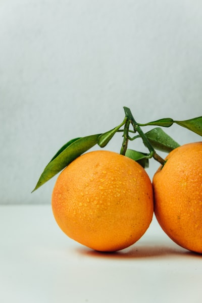

# 7. CNN + LSTM Hybrid Model

## Model Overview
Combines CNN (extracts image features from each frame) with LSTM (remembers patterns across multiple frames). Like reading a short video instead of a single photo.

## Architecture Diagram


*The CNN processes each frame independently, then LSTM reads the frame-by-frame sequence to classify the fruit.*

## Fruit Classes (Sequence Input)
Each sample is a **sequence of 4 image frames** of the same fruit:

| 🍎 Apple | 🍌 Banana | 🍊 Orange |
|:---:|:---:|:---:|
|  |  |  |
| Frame sequence → Class `0` | Frame sequence → Class `1` | Frame sequence → Class `2` |

## Dataset
**Custom Fake Fruit Image Sequence Dataset** (created with NumPy — no download needed)
- 120 sequences (40 per fruit), each with 4 frames of 8×8 RGB images
- 3 classes: `Apple (Red frames)`, `Banana (Yellow frames)`, `Orange`
- Same color-coded images as CNN, but now in sequence form

## Task
Classify a fruit by analyzing a **sequence of 4 image frames** (not just one image)

## Architecture
```
Input(4 frames, 8×8×3)
→ TimeDistributed(Conv2D(8, 3×3, ReLU))
→ TimeDistributed(Flatten)
→ LSTM(16)
→ Dense(3, Softmax)
```

## How to Run on Google Colab
1. Upload `cnn_lstm_model.ipynb` to [Google Colab](https://colab.research.google.com/)
2. Runtime → Change runtime type → **CPU** (default)
3. Runtime → **Run All**

## Expected Output
- Sample 4-frame sequence shown for Apple/Banana/Orange
- Train/Test accuracy after training
- Accuracy plot over epochs
- Grid of predictions across all 3 fruit types
